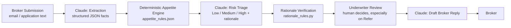

# AURA — AI Underwriting Risk Assistant

**Capstone Project — Quantum Shift AI Practitioner+ Program**

AURA is a proof-of-concept AI assistant for **Commercial P&C underwriting submission triage**. It reads a broker's raw submission, extracts the underwriting facts, checks them against the carrier's eligibility/appetite rules, produces a risk triage with rationale, and drafts a reply to the broker — cutting manual review time and reducing "leakage" (risk factors missed during a rushed manual read).

## Business Problem

Commercial P&C underwriting teams face submission overload, underwriter talent shortages, loss-ratio pressure, and brokers who expect fast decisions — especially in the E&S (Excess & Surplus) market, where capacity is limited and speed is a competitive advantage. Manual document review and eligibility checks are slow and inconsistent, which both slows down broker response times and causes leakage that hurts loss ratio discipline.

## How AURA Works



**Design choice:** eligibility against the carrier's hard appetite rules is decided by a **named rule engine in plain Python** (`appetite_rules.json` + `check_appetite()`), not the LLM — this keeps the underwriting gate auditable and consistent, and every verdict is traceable to the specific rule id that triggered it (e.g. `OVER_AUTHORITY_TIV`, `EXCLUDED_INDUSTRY`). Claude is used for the parts that need language understanding: turning messy text into structured data, writing a nuanced risk narrative, and drafting the broker reply.

**Second design choice:** Claude's risk rationale isn't trusted blindly either. A separate deterministic pass (`rationale_rules.py`) checks the rationale itself — e.g. an Ineligible account can never come back tagged "Low risk," and a dollar figure Claude cites has to trace back to something actually in the extracted data. This is a lightweight guardrail against the AI silently contradicting or hallucinating on top of the rule engine's decision. The underwriter always makes the final call, particularly on anything flagged "Refer."

## Eligibility Rules & Rationale Verification

**Eligibility (`appetite_rules.json`)** is a list of named, typed rules rather than scattered `if` statements — each has an `id`, a `type` (`industry_exclusion`, `max_value`, `min_value`, `state_max_value`, `text_contains`, `missing_fields_threshold`), and a `severity` (`Refer` or `Ineligible`). `check_appetite()` evaluates every rule generically and returns which ones fired. Current rules:

| Rule id | Checks |
|---|---|
| `EXCLUDED_INDUSTRY` | Industry class is on the prohibited list |
| `OVER_AUTHORITY_TIV` | TIV exceeds binding authority |
| `STATE_TIV_RESTRICTION` | Property TIV exceeds a state-specific catastrophe threshold (FL, CA) |
| `MIN_YEARS_IN_BUSINESS` | Business is too new |
| `MAX_LOSSES` | Too many losses in the last 3 years |
| `MIN_ANNUAL_REVENUE` | Account is smaller than the program's minimum size |
| `NON_RENEWED_FOR_CAUSE` | Prior carrier non-renewed for cause |
| `MISSING_FIELDS` | Too many key fields missing to evaluate |

**Rationale verification (`rationale_rules.py`)** runs *after* Claude produces its risk narrative and checks the narrative itself, independent of the verdict:

| Check id | Catches |
|---|---|
| `RATIONALE_MIN_LENGTH` | Rationale too thin to be useful |
| `TIER_CONSISTENT_WITH_INELIGIBLE` | Ineligible account tagged anything but High risk |
| `TIER_NOT_LOW_ON_REFER` | Refer account tagged Low risk |
| `DATA_GAPS_COVER_MISSING` | Extraction found gaps the rationale never flagged |
| `RATIONALE_GROUNDED_FIGURES` | A cited dollar figure that doesn't trace back to the extracted data (hallucination check) |
| `RATIONALE_ADDRESSES_TRIGGERED_RULES` | A triggered eligibility rule the rationale never actually discusses |

**Risk triage criteria** — what Claude is told to weigh when producing the Low/Medium/High tier — are likewise a named list (`RISK_CRITERIA` in `aura_engine.py`), rendered directly into `RISK_PROMPT`: `LOSS_NARRATIVE_SEVERITY`, `INDUSTRY_HAZARD`, `DATA_COMPLETENESS`, `THIRD_PARTY_EXPOSURE`, `BUSINESS_TENURE`, and `APPETITE_RESULT_FLOOR` (the eligibility verdict as an authoritative floor).

Both rule sets are covered in more detail, including the exact evaluation logic, in [`PROMPTS.md`](PROMPTS.md).

### Reference panel in the UI

All three of the above — extraction fields, eligibility rules, and risk criteria — are also exposed live in the app itself, as three collapsible sections below the main tool (`GET /api/reference`). They're generated from the exact same Python lists that drive the pipeline (`EXTRACTED_FIELDS`, `appetite_rules.json`'s `rules`, `RISK_CRITERIA`), not maintained as separate documentation, so what you see in the UI is guaranteed to match what actually runs.

## Project Structure

| File | Purpose |
|---|---|
| `server.py` | Web server (Python standard library `http.server`) — serves the UI plus `/api/analyze` (pipeline), `/api/samples`, and `/api/reference` (fields/rules/criteria for the collapsible UI sections) |
| `static/` | Frontend: `index.html`, `style.css`, `app.js` (vanilla JS, no framework) |
| `aura_engine.py` | Claude API calls (extraction, risk, drafting) via a direct REST request + the deterministic appetite rule engine. Prompts live here as named constants. |
| `appetite_rules.json` | Named eligibility rules for the fictional carrier (industry exclusions, TIV limits, loss thresholds, etc.) |
| `rationale_rules.py` | Deterministic checks on Claude's risk rationale — consistency with the verdict and groundedness in the extracted facts |
| `sample_submissions.py` | 4 synthetic broker submissions (clean, borderline, red-flag, incomplete) |
| `demo_responses.py` | Pre-generated Claude outputs for the 4 samples, used automatically when no API key is set |
| `PROMPTS.md` | The actual prompts used, with rationale |
| `presentation/` | 5-slide executive presentation |

**No third-party dependencies.** AURA is built entirely on the Python standard library (`http.server`, `urllib`, `json`) — no `pip install` is required. This was a deliberate choice, not just a convenience: it makes the PoC trivially portable across environments.

## Setup & Run

Set your API key as an environment variable (do **not** commit it anywhere — `.env` is gitignored if you use one):

```powershell
$env:ANTHROPIC_API_KEY = "sk-ant-..."
```

Or copy `.env.example` to `.env` and fill it in — `server.py` reads a `.env` file automatically if present.

Run the app:

```bash
python server.py
```

Open http://localhost:8000, pick one of the four sample submissions (or paste your own) in the left panel, and click **Analyze Submission**.

### Demo mode vs. live mode

If `ANTHROPIC_API_KEY` is **not** set, `server.py` automatically falls back to **demo mode**: it serves pre-generated Claude outputs from `demo_responses.py` for the 4 built-in sample submissions (the appetite check still runs live, since it's deterministic code, not an AI call). These aren't placeholder text — they're genuine Claude reasoning produced against the exact prompts in `aura_engine.py`/`PROMPTS.md`, captured once so the app is demonstrable without an API key. The UI shows a banner indicating which mode produced each result. As soon as a key is set, every request goes to the live Anthropic API instead, for any submission text (not just the 4 samples).

## Limitations & Next Steps (this is a PoC)

- Single fictional carrier and rule set; a real deployment would need per-program appetite configuration.
- Synthetic sample data only — no real broker submissions or loss run integrations.
- No document upload/OCR yet (PDF/ACORD form ingestion would be the natural next step) — text input only.
- No persistence/queue — a production version would track submissions, SLAs, and underwriter assignment.
- Impact metrics shown in the UI are illustrative, not measured production statistics.
